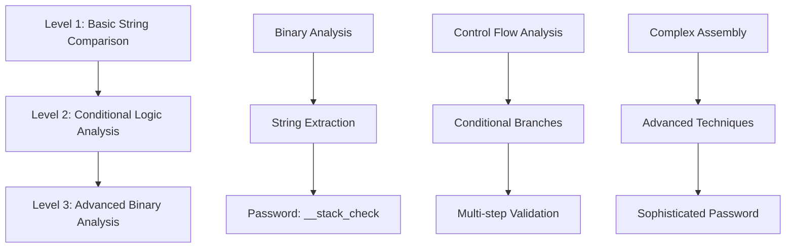

# Reverse Me - Binary Analysis Challenge

A multi-level reverse engineering challenge featuring progressively complex binary analysis tasks. Each level contains a binary that must be analyzed to discover hidden passwords.

## Challenge Overview

This project contains 3 levels of reverse engineering challenges, each with increasing complexity:



## Project Structure

```
reverse_me/
├── binary/          # Compiled binaries for each level
│   ├── level1       # Basic string comparison challenge
│   ├── level2       # Conditional logic challenge
│   └── level3       # Advanced binary analysis
├── levelX/          # Level X analysis materials
│   ├── source.c     # Reimplementation from scratch
│   ├── workflow.md  # Detailed analysis workflow
│   └── password     # Solution
...
```

## Analysis Methodology

Each level demonstrates different reverse engineering techniques:

- **Level 1**: Basic string comparison using `strcmp()` - Introduces fundamental binary analysis
- **Level 2**: Conditional logic with multiple validation steps - Explores control flow analysis
- **Level 3**: Advanced binary analysis requiring sophisticated reverse engineering techniques

## Tools & Requirements

- **GDB**: GNU Debugger for dynamic analysis
- **objdump**: Object file analyzer for disassembly  
- **strings**: Extract printable strings from binaries
- **hexdump**: Hex viewer for binary inspection
- **IDA Pro/Ghidra**: Advanced reverse engineering platforms (optional)
- Linux environment with debugging capabilities